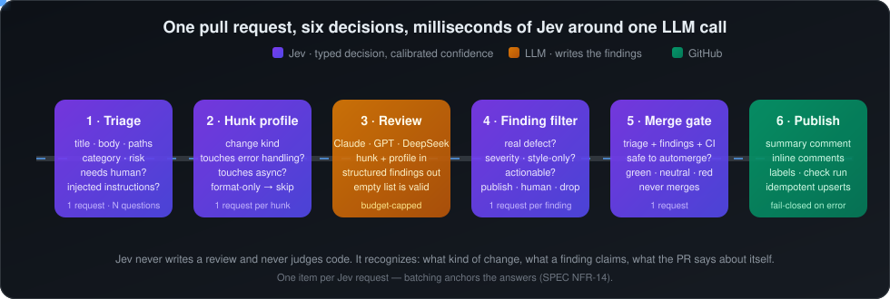
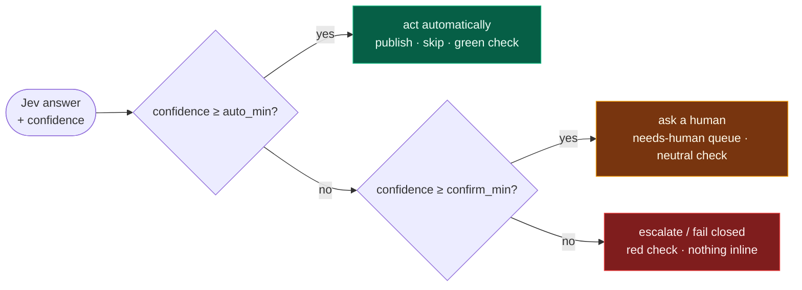

<div align="center">

# Jevest

**Automated pull-request review with [Jev](https://typesafe.ai) as the decision layer around an LLM reviewer.**
Jev decides *what to review, how much, and what to publish* in milliseconds with calibrated confidence. The LLM only writes the findings.

[](https://github.com/tincke10/Jevest/actions/workflows/ci.yml)
[](LICENSE)




</div>

---

## Why this exists

LLM review bots get switched off for three reasons: they comment too much, they spend the same effort on a dependency bump as on an auth change, and every false finding costs *another* LLM call to verify. Jevest puts a cheap, calibrated decision model in front of and behind the LLM:

| Pain | What Jevest does about it | Who decides |
|---|---|---|
| **Noise** | Every LLM finding is re-judged: real defect? style-only? actionable? High confidence publishes, medium goes to a human queue, low is dropped and counted | Jev, one request per finding |
| **Indiscriminate cost** | Triage on the PR's metadata, then a surface profile per hunk; format-only hunks never reach the LLM; per-run and cumulative spend caps | Jev + code |
| **Blind auto-merge** | A merge gate that only ever emits a check conclusion. Jevest has no merge call wired at all | Jev, one request |

And one rule that came from measuring, not from the pitch: **Jev never judges code.** It recognizes text: what kind of change a hunk is, what a finding claims, what a PR says about itself. Asking it "does this hunk have a bug?" failed on a clean dataset (see [Evidence](#evidence-so-far)). Asking it "what does this hunk touch?" works.

## What a run looks like

<div align="center">

</div>

Every run leaves on the PR:

- **one summary comment** (triage decision, hunks skipped and why, findings by band, cost, merge-gate verdict), upserted in place on every push;
- **inline comments** only for high-confidence findings, fingerprinted so re-runs never duplicate them;
- **labels** such as `jevest:needs-human`, `jevest:spend-warning`;
- **a `jevest` check run** carrying the merge-gate signal: green, neutral or red.

If Jev does not answer, the run **fails closed**: triage assumes high risk, nothing is published inline, everything goes to the human queue, the check goes red with the reason.

## How Jev decides

Every answer comes back with a probability and a confidence. The confidence lands in one of three bands, configured per stage and per risk level, and the band picks the action:



Thresholds rise with risk: a `critical` merge gate needs 0.999 to go green, a `low` one 0.95. Numbers are never handed to Jev to interpret (it does not count or compare); sizes and counts are resolved in code and passed as words. One item per request: packing ten hunks into one state makes the ten answers converge on each other, so Jevest never does it.

## Install in a repo

Three steps, no checkout, about 25 seconds per run.

**1. Add the workflow** `.github/workflows/jevest.yml`:

```yaml
name: Jevest review
on:
  pull_request:
    branches: [main]
permissions:
  contents: read
  pull-requests: write
  checks: write
  issues: write
  statuses: read
jobs:
  review:
    runs-on: ubuntu-latest
    steps:
      - uses: tincke10/Jevest@main
        with:
          typesafe-api-key: ${{ secrets.TYPESAFE_API_KEY }}
          anthropic-api-key: ${{ secrets.ANTHROPIC_API_KEY }}
          github-token: ${{ secrets.GITHUB_TOKEN }}
```

**2. Add the secrets**: `TYPESAFE_API_KEY` always, plus the key of the reviewer you pick below.

**3. Optionally add `.jevest.yml`** at the repo root. It is a partial override; write only what you change. A first rollout usually looks like this:

```yaml
reviewer:
  provider: none        # Jev-only for the first weeks: labels, summary and check, no LLM
publish:
  inlineComments: false
budgetUsd: 2            # per run
spendCap:
  usd: 50               # per month, for the whole service
  warnAtUsd: 40
```

Full reference, permissions and security notes: [docs/ACTION.md](docs/ACTION.md). Every default with its explanation: [config/jevest.example.yml](config/jevest.example.yml). Pinning to a release tag instead of `@main`: [docs/RELEASING.md](docs/RELEASING.md).

## Choose a reviewer

The LLM is pluggable behind one port and one prompt; switching is a config change.

| `reviewer.provider` | Models | Billing | Secret |
|---|---|---|---|
| `anthropic` (default) | `claude-sonnet-5`, `claude-opus-5` | API credits | `ANTHROPIC_API_KEY` |
| `openai` | any chat model | API credits | `OPENAI_API_KEY` |
| `deepseek` | `deepseek-v4-pro`, `deepseek-flash` | API credits, 4–15× cheaper per token | `DEEPSEEK_API_KEY` |
| `claude-cli` | `claude-opus-5`, `claude-sonnet-5` | A Claude **Pro/Max subscription** via `claude setup-token` | `CLAUDE_CODE_OAUTH_TOKEN` |
| `none` | — | Free: Jev-only run | — |

Three cost controls stack on top of each other:

| Control | Scope | Default | When it bites |
|---|---|---|---|
| `budgetUsd` | one run | 5 | the review stage stops calling the LLM, remaining hunks are reported as skipped |
| `spendCap` | the whole repo, per month or total | 50 / warn at 40 | the LLM stage is skipped, run continues Jev-only, banner + label + `::warning::` |
| `maxHunks` | one run | 50 | extra hunks are not profiled or reviewed |

The cumulative ledger lives in an issue of your own repo ("Jevest spend ledger"), updated by every run. Reset it by editing or closing the issue.

## Evidence so far

Jevest is built spike-first: a hypothesis with a pass/fail criterion written down *before* the run, a dataset with exact labels, recorded fixtures so anyone can replay the numbers without a key. Everything below ran against the real `jev-latest`.

| Hypothesis | Question to Jev | Result | Verdict |
|---|---|---|---|
| **H0** | "Does this hunk have a defect?" — 100 source hunks, 50/50 | P 0.84 · R 0.72 · F1 0.77 · **confidence ≈ 0** | **FAIL** → pivot: Jev never judges defects |
| **H0′** | "What kind of change is this? Does it touch error handling / async / public API?" | `change_kind` acc 0.80 (conf 0.97) · `touches_error_handling` F1 0.89 · `touches_async` F1 0.85 | **PARTIAL** → error handling and async in the pipeline, public API via AST instead |
| **H1** | "Is this LLM finding a real defect?" — the central hypothesis | Thorough reviewer, 299 findings (137 real / 162 noise): Jev AUC 0.592 (recall 0.920, noise discarded 0.173 at best threshold); DeepSeek LLM-judge control AUC 0.567 (recall 0.955) — both near chance. Full numbers: [docs/BENCHMARK.md](docs/BENCHMARK.md) | **FAIL** (inconclusive: label invalidated by the LLM-judge control) |
| **H7** | "Does the PR description match what actually changed?" — 100 PRs, 100 crossed descriptions with exact labels | with an LLM summary of the diff: R 0.99 · P 1.00 · ECE 0.07 · median conf 0.90. Without it: R 0.88, ECE 0.10 | **PASS** with summary → product-aware triage |
| **H5** | Adversarial PRs: injected instructions in body, title, labels, comments, strings, unicode; secrets; whitespace floods | 14/14: 0 undue green checks, 0 suppressed critical findings, 0 leaks. First run caught a real guard bug, fixed | **PASS** |

Two things we learned the hard way and now enforce in code: dataset labels must be clean before any number means anything (v1 had test files and docs confounding the label), and batching items into one Jev request anchors the answers to each other (std 0.004–0.026 across ten different hunks). Reports live in [`reports/`](reports), the write-ups in [`docs/analysis/`](docs/analysis), the full design and decision log in [docs/SPEC.md](docs/SPEC.md).

## Architecture

Hexagonal, strict TypeScript, strict TDD.

```
src/domain/        questions · decisions · confidence bands · metrics · spend cap · ports (no SDK imports)
src/adapters/      typesafe · fake · recorded decision adapters
                   reviewers: anthropic · openai · deepseek · claude-cli · recorded
                   summarizers · spend ledgers (GitHub issue, local file) · vcs (GitHub, local diff) · config
src/application/   the six pipeline stages · spike runners · reports · datasets loaders
src/action/        the GitHub Action entrypoint
scripts/           CLIs: spike · spike:profile · filter · findings · coherence · review · action
datasets/          hunks.jsonl (100, labeled) · findings.jsonl · prs.jsonl (100) · coherence-pairs.jsonl (200)
tests/fixtures/    recorded Jev and LLM answers: every report replays offline
```

Every real API is behind a port with a fake and a recorded adapter, so the whole suite and every spike run without a key. The Action runs the TypeScript source with `tsx`; there is no build step and no bundle to drift.

## Local development

```sh
pnpm install
pnpm test && pnpm typecheck && pnpm lint
```

| Command | What it does |
|---|---|
| `pnpm spike --mode replay` | H0 report from recorded fixtures (no key) |
| `pnpm spike:profile --mode replay` | H0′ report |
| `pnpm filter --findings datasets/findings-thorough.jsonl --mode replay --judge deepseek --judge-mode replay` | H1 / H6 / H3 finding-filter report (zero cost) |
| `pnpm findings --provider claude-cli --record` | generate LLM findings over the hunks dataset |
| `pnpm dataset:prs` · `pnpm coherence:summarize` · `pnpm coherence` | H7: collect PRs, summarize diffs, run the coherence spike |
| `pnpm review --git main..HEAD` or `--diff <file>` | run the six stages locally on a diff |
| `pnpm action` | run the Action entrypoint with `INPUT_*` env vars |

Live runs need `TYPESAFE_API_KEY`; reviewers need `ANTHROPIC_API_KEY`, `OPENAI_API_KEY` or `DEEPSEEK_API_KEY`; `claude-cli` uses your local Claude Code login. Keys are read from the environment only and are never written to a file.

## Roadmap

- [x] Phase 0 · H0 spike, dataset v2, pivot
- [x] Phase 0b · H0′ surface profile, AST labeler, batch-anchoring fix
- [x] Phase 1b · six-stage local pipeline, fail-closed, idempotent publishing
- [x] Phase 2 · composite GitHub Action, no checkout, partial `.jevest.yml`, spend cap
- [x] Phase 0c · H7 intent–change coherence (PASS with an LLM diff summary) → product-aware triage: three-layer state, `.jevest/context.yml` read from the base branch, `jevest:description-mismatch` and `jevest:needs-product-owner` labels
- [x] Phase 3a · adversarial suite H5 (14 cases, PASS, replayed in CI), consolidated [benchmark](docs/BENCHMARK.md), [published datasets](datasets/README.md), changelog and [release guide](docs/RELEASING.md)
- [x] Phase 1a · H1 finding filter measured (2026-09-22, thorough reviewer pass, 299 findings): **FAIL / inconclusive** — the DeepSeek LLM-judge control scores AUC 0.567 on the same labels Jev scores 0.592 on, so the line-overlap label doesn't separate real defects from noise either. H6 (judge cost) **PASS**, H3 (calibration) **FAIL** on the same caveat. See [docs/BENCHMARK.md](docs/BENCHMARK.md)
- [ ] Human-labeled sample (≥ 60 findings) → valid H1 verdict; stage-4 discard vs annotate-only decision
- [ ] Phase 3b · tagged `v0.1.0` release once H1 has a number
- [x] In-diff injection detection as a hunk-profile question (`contains_reviewer_instructions`: 0.99 on hidden instructions, 0.01–0.02 elsewhere), H2/H4 instrumented on every run (Efficiency section, action outputs)
- [ ] Next · near-duplicate crossed descriptions for a harder H7; a verdict on H2 once ≥ 20 real PRs have run

## License

[MIT](LICENSE). Datasets are derived from MIT-licensed open-source repositories (zod, vitest, hono, tRPC); see [datasets/README.md](datasets/README.md).
