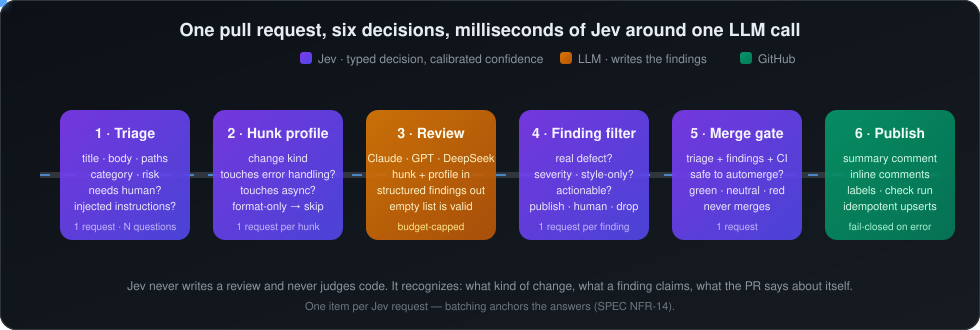
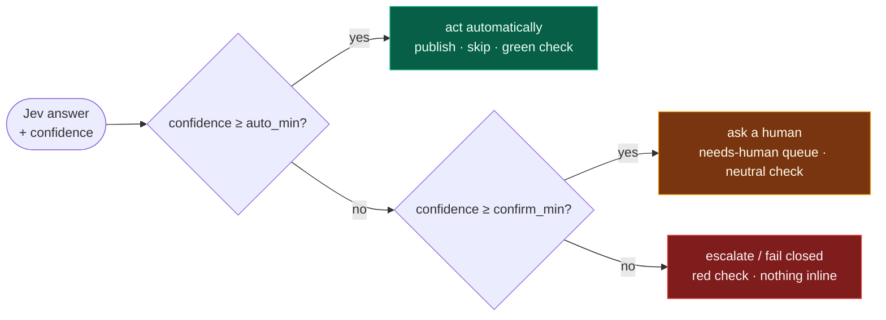

<div align="center">

# Jevest

**Automated pull-request review with [Jev](https://typesafe.ai) as the decision layer around an LLM reviewer.**
Jev decides *what to review, how much, and what to publish* in milliseconds with calibrated confidence. The LLM only writes the findings.

[](https://github.com/tincke10/Jevest/actions/workflows/ci.yml)
[](LICENSE)




</div>

---

## Why this exists

LLM review bots get switched off for three reasons: they comment too much, they spend the same effort on a dependency bump as on an auth change, and every false finding costs *another* LLM call to verify. Jevest puts a cheap, calibrated decision model in front of and behind the LLM:

| Pain | What Jevest does about it | Who decides |
|---|---|---|
| **Noise** | Every LLM finding is re-judged: real defect? style-only? actionable? High confidence publishes, medium goes to a human queue, low is annotated (default) or filtered, per `findingFilter.mode` | Jev, one request per finding |
| **Indiscriminate cost** | Triage on the PR's metadata, then a surface profile per hunk; format-only hunks never reach the LLM; per-run and cumulative spend caps | Jev + code |
| **Blind auto-merge** | A merge gate that only ever emits a check conclusion. Jevest has no merge call wired at all | Jev, one request |

And one rule that came from measuring, not from the pitch: **Jev never judges code.** It recognizes text: what kind of change a hunk is, what a finding claims, what a PR says about itself. Asking it "does this hunk have a bug?" failed on a clean dataset (see [Evidence](#evidence-so-far)), and a Jev-only reviewer found 0 of 44 issues on real PRs (see [Results](#results)). Asking it "what does this hunk touch?" works.

## How it reviews

Two review modes, one pipeline around them (triage, hunk profile, verdict, labels, merge gate and publishing are the same):

| `reviewer.mode` | What finds the issues | Needs | Status |
|---|---|---|---|
| `agentic` | **One read-only agent per PR** (`claude -p`, only Read / Grep / Glob, confined to a checkout of the head, secrets deny-listed). It opens the changed files, greps for callers, tests and consumers, and reports every problem with a failing scenario and quoted evidence. Then: deterministic hard exclusions, the evidence quotes checked against the code, an optional refuting verifier agent per finding, and Jev routing each survivor to *publish* or *question* (Jev never discards here) | `reviewer.provider: claude-cli` and `actions/checkout` of the PR head | **Default since 1.0** (with the default provider, `claude-cli`) |
| `hunks` | One LLM request per hunk, optionally with the full file and impact context; Jev's finding filter bands the results | any provider; no checkout | Legacy, fully supported; the mode for `anthropic`, `openai`, `deepseek` and `none`, or set `reviewer.mode: hunks` |

On real PRs the agentic mode shows over five times the weighted recall of the per-hunk reviewer, at a third of the cost of per-hunk review with full context ([Results](#results)): about $1.60 nominal and 2.5–7 minutes per PR. Setup, trust model and cost: [docs/ACTION.md](docs/ACTION.md#agentic-review-reviewermode-agentic). Upgrading from 0.1: [docs/MIGRATING.md](docs/MIGRATING.md).

## What a run looks like

<div align="center">

</div>

Every run leaves on the PR:

- **one summary comment** (triage decision, hunks skipped and why, findings by band, cost, merge-gate verdict), upserted in place on every push;
- **inline comments** only for high-confidence findings, fingerprinted so re-runs never duplicate them;
- **one verdict label** saying what to do next (`jevest: fix before merge`, `jevest: answer questions`, `jevest: ready to approve` or `jevest: review manually`, in Spanish by default), a risk label, and others such as `jevest:auto-merge-ok`, `jevest:spend-warning`;
- **a `jevest` check run** carrying that verdict: red only when there is something to fix, neutral for questions or when the automated review could not run, green when there is nothing to fix (see [docs/ACTION.md](docs/ACTION.md#review-verdict)).

If Jev does not answer, the run **fails closed**: triage assumes high risk, nothing is published inline, everything goes to the human queue, the check goes red with the reason.

## How Jev decides

Every answer comes back with a probability and a confidence. The confidence lands in one of three bands, configured per stage and per risk level, and the band picks the action:


```mermaid
flowchart LR
    A([Jev answer<br/>+ confidence]) --> B{confidence ≥ auto_min?}
    B -- yes --> C[act automatically<br/>publish · skip · green check]
    B -- no --> D{confidence ≥ confirm_min?}
    D -- yes --> E[ask a human<br/>needs-human queue · neutral check]
    D -- no --> F[escalate / fail closed<br/>red check · nothing inline]
    style C fill:#065f46,color:#ecfdf5,stroke:#10b981
    style E fill:#78350f,color:#fffbeb,stroke:#f59e0b
    style F fill:#7f1d1d,color:#fef2f2,stroke:#ef4444
```

Thresholds rise with risk: a `critical` merge gate needs 0.999 to go green, a `low` one 0.95. Numbers are never handed to Jev to interpret (it does not count or compare); sizes and counts are resolved in code and passed as words. One item per request: packing ten hunks into one state makes the ten answers converge on each other, so Jevest never does it.

## Install in a repo

Three steps for the default setup: the agentic reviewer on a Claude Pro/Max subscription, reading a checkout of the PR head; a run takes a few minutes. For the legacy per-hunk mode (any provider, no checkout, about 25 seconds per run) see [docs/MIGRATING.md](docs/MIGRATING.md#staying-on-the-legacy-per-hunk-mode).

**1. Add the workflow** `.github/workflows/jevest.yml`:

```yaml
name: Jevest review
on:
  pull_request:
    branches: [main]
permissions:
  contents: read
  pull-requests: write
  checks: write
  issues: write
  statuses: read
jobs:
  review:
    runs-on: ubuntu-latest
    steps:
      - uses: actions/checkout@v4
        with:
          ref: ${{ github.event.pull_request.head.sha }}
          fetch-depth: 1
      - uses: tincke10/Jevest@v1
        with:
          typesafe-api-key: ${{ secrets.TYPESAFE_API_KEY }}
          claude-code-oauth-token: ${{ secrets.CLAUDE_CODE_OAUTH_TOKEN }}
          github-token: ${{ secrets.GITHUB_TOKEN }}
```

**2. Add the secrets** as **repository** secrets of the repo that runs the workflow: `TYPESAFE_API_KEY` always, and `CLAUDE_CODE_OAUTH_TOKEN` from `claude setup-token` for the default reviewer (or the key of the provider you pick below). Configure the Claude token per repository, never as a shared organization secret: each repo's usage, rotation and revocation stay independent.

**3. Optionally add `.jevest.yml`** at the repo root. It is a partial override; write only what you change. A first rollout usually looks like this:

```yaml
reviewer:
  provider: none        # Jev-only for the first weeks: labels, summary and check, no LLM
publish:
  inlineComments: false
budgetUsd: 2            # per run
spendCap:
  usd: 50               # per month, for the whole service
  warnAtUsd: 40
```

Size `spendCap` for the agentic mode: at about $1.60 nominal per PR, the default 50 a month covers roughly 30 PRs before the LLM stage is skipped.

Full reference, permissions and security notes: [docs/ACTION.md](docs/ACTION.md). Every default with its explanation: [config/jevest.example.yml](config/jevest.example.yml). `@v1` follows every `v1.x.y`; pinning an exact version: [docs/RELEASING.md](docs/RELEASING.md).

## Choose a reviewer

The LLM is pluggable behind one port and one prompt; switching is a config change.

| `reviewer.provider` | Models | Billing | Secret |
|---|---|---|---|
| `claude-cli` (default) | `claude-opus-5-5` (default, agentic), `claude-sonnet-5` (default, per-hunk) | A Claude **Pro/Max subscription** via `claude setup-token` | `CLAUDE_CODE_OAUTH_TOKEN` |
| `anthropic` | `claude-sonnet-5` (default), `claude-opus-5` | API credits; per-hunk mode | `ANTHROPIC_API_KEY` |
| `openai` | any chat model (set `reviewer.model`) | API credits; per-hunk mode | `OPENAI_API_KEY` |
| `deepseek` | `deepseek-v4-pro`, `deepseek-flash` (set `reviewer.model`) | API credits, 4–15× cheaper per token; per-hunk mode | `DEEPSEEK_API_KEY` |
| `none` | — | Free: Jev-only run | — |

Three cost controls stack on top of each other:

| Control | Scope | Default | When it bites |
|---|---|---|---|
| `budgetUsd` | one run | 5 | the review stage stops calling the LLM, remaining hunks are reported as skipped |
| `spendCap` | the whole repo, per month or total | 50 / warn at 40 | the LLM stage is skipped, run continues Jev-only, banner + label + `::warning::` |
| `maxHunks` | one run | 50 | extra hunks are not profiled or reviewed |

The cumulative ledger lives in an issue of your own repo ("Jevest spend ledger"), updated by every run. Reset it by editing or closing the issue.

## Results

The whole review, measured end to end on real pull requests from a production Laravel + Vue application, against issues an adjudicator verified in the code ([eval harness](docs/EVAL.md)). Weighted recall is the severity-weighted share of real issues the review shows; precision is the share of shown findings adjudicated real or partly real.

| Set | Variant | Weighted recall | Precision | Cost / PR |
|---|---|---|---|---|
| tuning, 6 PRs | per-hunk reviewer (v0.1 default) | 7.7% | 25% | $1.4 |
| tuning, 6 PRs | per-hunk + full file + impact context + evidence | 26.9% | ~40% | $5 |
| tuning, 6 PRs | Jev-only reviewer, diff only | 0% | — | < $0.01 |
| tuning, 6 PRs | **agentic, Opus 5.5, effort xhigh + verifier** | **41.7%** | **87%** | $1.60 |
| held-out, 10 PRs | **agentic, Opus 5.5, effort xhigh + verifier** | **58.2%** | **82.4%** | $1.60 |
| held-out, 10 PRs | independent full-repo agent review (reference) | 67.3% | 87% | — |

What it taught us: per-hunk review without repository context misses cross-file bugs and invents claims about code it never saw; one read-only agent per PR is cheaper and better; the agent's effort must be set explicitly (`--safe-mode` ignores user settings: at the CLI default the agent reached 18% weighted recall, at an explicit `xhigh` with the verifier 42%); the finder should report everything and leave precision to evidence checks and a refuting verifier; and Jev earns its place in triage, injection detection, routing and labels (~10–20 s per PR), not as a judge of code findings — its staged judge discarded only valid ones, so it no longer discards. Recall is relative to the issues two reviewers found (absolute recall is unknown), the sets are small, the adjudicator is an LLM, and costs are nominal list-price equivalents from a subscription. Every variant and caveat: [docs/BENCHMARK.md](docs/BENCHMARK.md#review-quality-on-real-prs-eval-harness).

## Evidence so far

Jevest is built spike-first: a hypothesis with a pass/fail criterion written down *before* the run, a dataset with exact labels, recorded fixtures so anyone can replay the numbers without a key. Everything below ran against the real `jev-latest`.

| Hypothesis | Question to Jev | Result | Verdict |
|---|---|---|---|
| **H0** | "Does this hunk have a defect?" — 100 source hunks, 50/50 | P 0.84 · R 0.72 · F1 0.77 · **confidence ≈ 0** | **FAIL** → pivot: Jev never judges defects |
| **H0′** | "What kind of change is this? Does it touch error handling / async / public API?" | `change_kind` acc 0.80 (conf 0.97) · `touches_error_handling` F1 0.89 · `touches_async` F1 0.85 | **PARTIAL** → error handling and async in the pipeline, public API via AST instead |
| **H1** | "Is this LLM finding a real defect?" — the central hypothesis | On a reversed-hunk dataset built to give the fix-aware oracle label a real-finding population (H1b, 55 real / 154 noise): Jev recall 0.964, 52% of noise discarded at the best threshold, AUC 0.79 vs. 0.87 for an Opus judge at 705× the cost. Full numbers, curves and caveats (n=55, shared-model bias, artificial recall population): [docs/BENCHMARK.md](docs/BENCHMARK.md) | **PASS** on H1b (2026-09-23) |
| **H6** | Is the Jev filter ≥ 100× cheaper than an LLM judge at equal recall? | On H1b: 704.7× cheaper; the judge only matches Jev's recall at its own best threshold, at ~700× the cost and ~25× the latency | **PASS** |
| **H3** | Is confidence calibrated over findings (ECE < 0.1)? | Raw ECE 0.284 on H1b (base rate 0.263) — Jev's probabilities run above the true real rate, same pattern every time this has been measured. A post-hoc Platt map (2026-09-23) reaches a held-out ECE of 0.071 on the set it was fitted on, without touching the ranking, but carries 0.216 to a set with a ten-times-lower base rate — so it ships as an opt-in, default off | **FAIL** (post-hoc, default off) |
| **H7** | "Does the PR description match what actually changed?" — 100 PRs, 100 crossed descriptions with exact labels | with an LLM summary of the diff: R 0.99 · P 1.00 · ECE 0.07 · median conf 0.90. Without it: R 0.88, ECE 0.10. Holds on the harder near-duplicate crossing too (2026-09-23): R 0.97 · P 1.00 with summary, R 0.83 without — [docs/BENCHMARK.md](docs/BENCHMARK.md) | **PASS** with summary → product-aware triage |
| **H5** | Adversarial PRs: injected instructions in body, title, labels, comments, strings, unicode; secrets; whitespace floods | 14/14: 0 undue green checks, 0 suppressed critical findings, 0 leaks. First run caught a real guard bug, fixed | **PASS** |

Two things we learned the hard way and now enforce in code: dataset labels must be clean before any number means anything (v1 had test files and docs confounding the label), and batching items into one Jev request anchors the answers to each other (std 0.004–0.026 across ten different hunks). Reports live in [`reports/`](reports), the write-ups in [`docs/analysis/`](docs/analysis), the full design and decision log in [docs/SPEC.md](docs/SPEC.md).

## Architecture

Hexagonal, strict TypeScript, strict TDD.

```
src/domain/        questions · decisions · confidence bands · metrics · spend cap · ports (no SDK imports)
src/adapters/      typesafe · fake · recorded decision adapters
                   reviewers: anthropic · openai · deepseek · claude-cli · recorded
                   summarizers · spend ledgers (GitHub issue, local file) · vcs (GitHub, local diff) · config
src/application/   the six pipeline stages · spike runners · reports · datasets loaders
src/action/        the GitHub Action entrypoint
scripts/           CLIs: spike · spike:profile · filter · findings · coherence · review · action
datasets/          hunks.jsonl (100, labeled) · findings.jsonl · prs.jsonl (100) · coherence-pairs.jsonl (200)
tests/fixtures/    recorded Jev and LLM answers: every report replays offline
```

Every real API is behind a port with a fake and a recorded adapter, so the whole suite and every spike run without a key. The Action runs the TypeScript source with `tsx`; there is no build step and no bundle to drift.

## Local development

```sh
pnpm install
pnpm test && pnpm typecheck && pnpm lint
```

| Command | What it does |
|---|---|
| `pnpm spike --mode replay` | H0 report from recorded fixtures (no key) |
| `pnpm spike:profile --mode replay` | H0′ report |
| `pnpm filter --findings datasets/findings-thorough.jsonl --mode replay --judge deepseek --judge-mode replay` | H1 / H6 / H3 finding-filter report (zero cost) |
| `pnpm calibrate` | H3 post-hoc calibration study over both oracle sets (replay only, zero cost) |
| `pnpm findings --provider claude-cli --record` | generate LLM findings over the hunks dataset |
| `pnpm dataset:prs` · `pnpm coherence:summarize` · `pnpm coherence` | H7: collect PRs, summarize diffs, run the coherence spike |
| `pnpm review --git main..HEAD` or `--diff <file>` | run the six stages locally on a diff |
| `pnpm action` | run the Action entrypoint with `INPUT_*` env vars |

Live runs need `TYPESAFE_API_KEY`; reviewers need `ANTHROPIC_API_KEY`, `OPENAI_API_KEY` or `DEEPSEEK_API_KEY`; `claude-cli` uses your local Claude Code login. Keys are read from the environment only and are never written to a file.

## Roadmap

- [x] Phase 0 · H0 spike, dataset v2, pivot
- [x] Phase 0b · H0′ surface profile, AST labeler, batch-anchoring fix
- [x] Phase 1b · six-stage local pipeline, fail-closed, idempotent publishing
- [x] Phase 2 · composite GitHub Action, no checkout, partial `.jevest.yml`, spend cap
- [x] Phase 0c · H7 intent–change coherence (PASS with an LLM diff summary) → product-aware triage: three-layer state, `.jevest/context.yml` read from the base branch, `jevest:description-mismatch` and `jevest:needs-product-owner` labels
- [x] Phase 3a · adversarial suite H5 (14 cases, PASS, replayed in CI), consolidated [benchmark](docs/BENCHMARK.md), [published datasets](datasets/README.md), changelog and [release guide](docs/RELEASING.md)
- [x] Phase 1a · H1 finding filter measured (2026-09-22, thorough reviewer pass, 299 findings): **FAIL / inconclusive** — the DeepSeek LLM-judge control scores AUC 0.567 on the same labels Jev scores 0.592 on, so the line-overlap label doesn't separate real defects from noise either. H6 (judge cost) **PASS**, H3 (calibration) **FAIL** on the same caveat. Re-scored against a fix-aware oracle label the same day (AUC 0.708 Jev / 0.700 judge, n=7 real — too few for a recall verdict), then measured → **PASS** on H1b below. See [docs/BENCHMARK.md](docs/BENCHMARK.md)
- [x] Fix-aware oracle label (automatic, non-circular — labeler sees the real fix, commit message and issue/PR text, 2026-09-22): re-scored H1 AUC 0.592 → 0.708 (Jev) and 0.567 → 0.700 (DeepSeek judge), proving the label carries real signal, but the set yields only 7 real findings in 299 — too few for a recall verdict. H1 stays FAIL formally, H6 PASS (182×), H3 FAIL (ECE 0.504). Stage 4 stays annotate-only. See [docs/BENCHMARK.md](docs/BENCHMARK.md)
- [x] H1b · reversed-hunk dataset for a real-finding population (2026-09-23, on the Claude subscription: 55 real / 154 noise): H1 **PASS** (recall 0.964, 52% of noise discarded at threshold 0.45, AUC 0.792), H6 **PASS** (704.7× cheaper than an Opus judge), H3 stays **FAIL** (ECE 0.284). Caveats: n=55 recall interval is wide, oracle labeler and judge share a model, reversed diff is an artificial recall population. See [docs/BENCHMARK.md](docs/BENCHMARK.md)
- [x] Phase 3b · `v0.1.0` tagged 2026-09-23, GitHub release with every dataset attached ([docs/RELEASING.md](docs/RELEASING.md))
- [x] In-diff injection detection as a hunk-profile question (`contains_reviewer_instructions`: 0.99 on hidden instructions, 0.01–0.02 elsewhere), H2/H4 instrumented on every run (Efficiency section, action outputs)
- [x] H7 hard · near-duplicate crossed descriptions (2026-09-23): PASS with summary R 0.97 P 1.00, PARTIAL without (R 0.83). Near-duplicate donors (by directory Jaccard, same repo) cost 2 points of recall with the summary and 5 without it. See [docs/BENCHMARK.md](docs/BENCHMARK.md)
- [x] H3 post-hoc calibration study (2026-09-23): a Platt map fitted on H1b reaches a held-out ECE of 0.071 (from 0.284) with the ranking and the AUC untouched, but carries 0.216 to a set with a ten-times-lower base rate. Shipped as `findingFilter.calibration`, **default off**, with Jevest's own map published under `config/calibration/`. H3 stays FAIL. See [docs/BENCHMARK.md](docs/BENCHMARK.md)
- [x] Review quality on real PRs (2026-09/10): eval harness with private golden sets, adjudication, re-scoring and a same-root-cause matcher; agentic mode (one read-only agent per PR + evidence check + refuting verifier, Jev routes but never discards) reaches 41.7% weighted recall / 87% precision on a 6-PR tuning set and 58.2% / 82.4% on 10 held-out PRs, against 7.7% / 25% for the per-hunk reviewer. See [docs/BENCHMARK.md](docs/BENCHMARK.md#review-quality-on-real-prs-eval-harness)
- [ ] Next · a verdict on H2 once ≥ 20 real PRs have run
- [ ] Next · flip stage 4 to discard after ≥ 20 real PRs; refit `is_real_defect` calibration on real-PR findings, where the base rate is the one that matters

## License

[MIT](LICENSE). Datasets are derived from MIT-licensed open-source repositories (zod, vitest, hono, tRPC); see [datasets/README.md](datasets/README.md).
